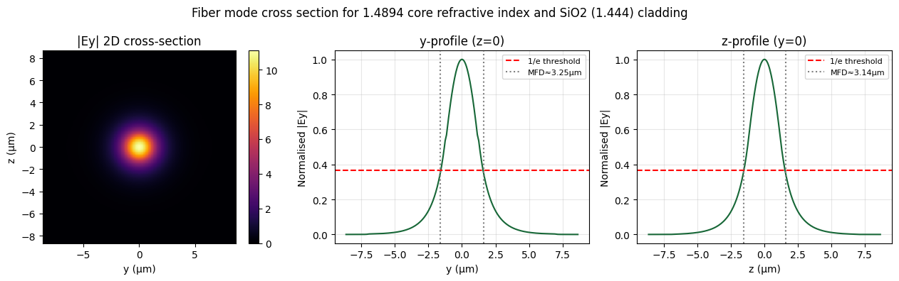
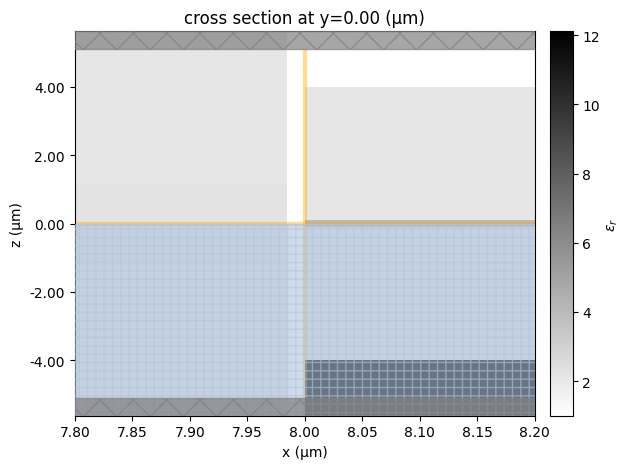
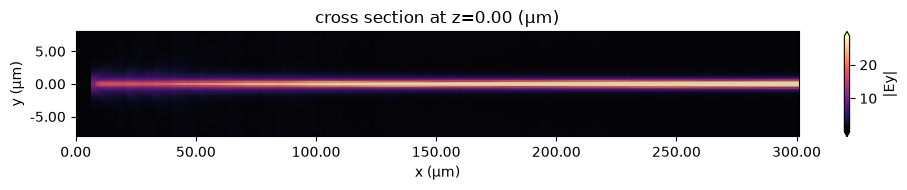
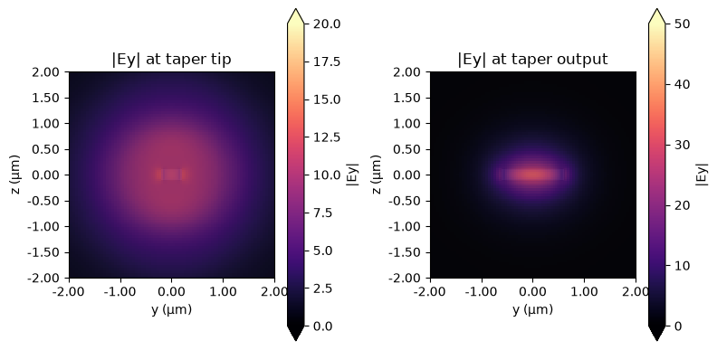
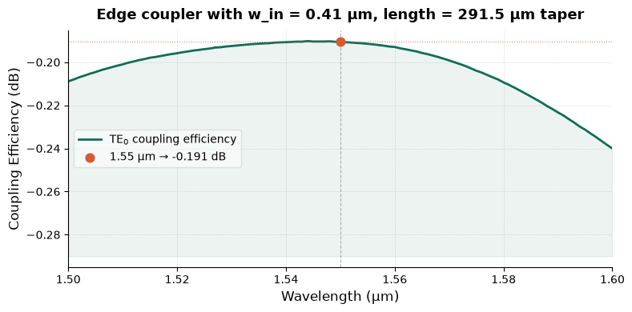

SiN Edge Coupler
=================

Overview
--------
In this directory a Silicon Nitride Edge Coupler is implemented using FDTD (Tidy3D), based on the paper "High-Efficinency Fiber Edge Coupling for Silicon Nitride Integrated Photonics" (https://www.mdpi.com/2072-666X/16/12/1401).

Achieving low coupling losses is essential in many photonics applications, and especially when working with single photons.

Contents
--------
- SiN_edge_coupler.ipynb — primary notebook demonstrating setup, simulation, and analysis.
- fiber_modelling.py — helper script for modeling the fiber mode and overlap integrals.
- full_domain.hdf5 — final simulation dataset (binary HDF5).
- n_core.json — refractive index / core parameters used by the notebooks.
- misc/ — additional files used during optimization process.

Methodology
-----------
1. The source is modelled as the eigenmode of an optical fiber, inspired by this tutorial: https://www.flexcompute.com/tidy3d/examples/notebooks/BilayerSiNEdgeCoupler/?hide_nav=true.
Since the materials of the UHNA-7 fiber are not known based on the datasheet (https://media.thorlabs.com/globalassets/items/u/uh/uhn/uhna7/ttn290645-s01.pdf?v=0116033352), we assume SiO2 cladding and look for the core index that will lead to a 3.2um mode profile.
Through the fiber_modelling.py file we get:

2. The simulation consists of the fiber and a SiN waveguide with SiO2 cladding and box on a Si substrate.
The fiber and chip are separated by a small air gap for a more realistic, unpackaged, simulation.
This is a close-up of the coupling region:

3. Since recreating the exact results from the paper depends heavily on the material properties, an optimization around the paper geometry is done.
An adoing-method-based gradient descent optimization is implemented.
Since the computational cost is high, due to the large y-z plane required to capture the fiber mode properly, the optimization is done with a smaller y-z cross section.

4. A full-domain simulation is run with the final optimization parameters.

Results
-----------
- The final design has an input width of 0.41um, and a linear taper with 291.5um length.
The corresponding values from the paper are 0.5um and 280um respectively.
- The following plots show the (dominant) field along the propagation, and at the input and output of the taper:

- From a mode monitor at the end of the taper, and start of the straight waveguide scetion, we get this coupling efficiency spectrum:

Further Improvements
-----------
- In the paper a 0.1dB loss is achieved, compared to 0.19dB achieved here.
- Further improvements are expected by breaking down the loss into: mode overlap loss at the facet of the chip, and taper loss.